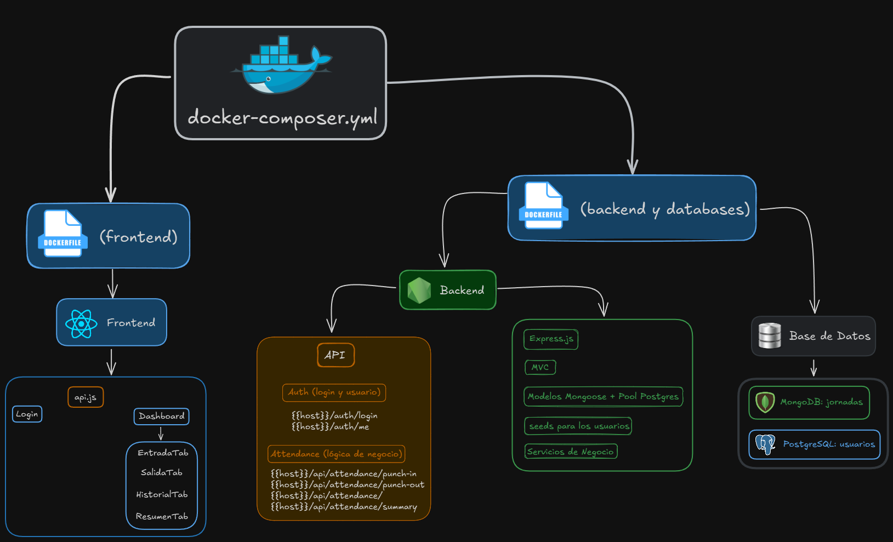

# Control de Jornadas

Aplicación web para registrar y consultar las jornadas laborales de los usuarios.

---

## 📖 Descripción
Este proyecto implementa un sistema **full-stack** contenedorizado (Docker) para el control de entradas y salidas de los usuarios:

- **Backend**: Node.js + Express (arquitectura MVC), autenticación JWT, conexión a PostgreSQL (usuarios) y MongoDB (jornadas).
- **Frontend**: React SPA con React Router, llamadas a la API protegidas por token, componentes para fichar entrada/salida, historial y resumen.
- **Infraestructura**: Dockerfiles para frontend y backend, y un `docker-compose.yml` que orquesta todos los servicios (frontend, backend, postgres, mongo).

---

## 🏗️ Arquitectura del Sistema



---

## 🛠️ Variables de Entorno

Antes de levantar los contenedores, es necesario revisar y ajustar los valores en los archivos `.env` correspondientes:

### Backend (`backend/.env`)
```dotenv
# Puerto de la API
PORT=4000

# PostgreSQL (usuarios)
PG_HOST=postgres
PG_USER=postgres
PG_PASS=password
PG_DB=control_jornada
PG_PORT=5432

# MongoDB (jornadas)
MONGODB_URI=mongodb://mongo:27017/control_jornada

# Clave secreta para JWT
authorization
JWT_SECRET=0C+3Gq^G>9_Kuc"`M7eb1_b9kCem|,
```

### Frontend (`frontend/.env`)
```dotenv
# URL base de la API (debe apuntar al backend)
VITE_API_URL=http://localhost:4000
```

---

## 🚀 Quickstart

### Requisitos previos
- Docker & Docker Compose
- Node.js (opcional, si se desea ejecutar sin contenedores)

### Levantar la aplicación
```bash
git clone <repo-url>
cd control-jornada
docker-compose up --build
```

- **Frontend** estará disponible en `http://localhost:3000`
- **Backend** en `http://localhost:4000`

---

## 🔐 Credenciales de prueba
| Rol        | Email                 | Contraseña        |
|------------|-----------------------|-------------------|
| Asesor     | asesor@example.com    | password123       |
| Moderador  | moderador@example.com | password321       |
| Supervisor | supervisor@example.com| password132       |

---

## 📦 Contenedores Docker

- **frontend**: construye y sirve la SPA desde Nginx.
- **backend**: arranca Express, expone API en el puerto 4000.
- **postgres**: base de datos relacional para usuarios.
- **mongo**: base de datos NoSQL para registros de jornada.

El orquestador en `docker-compose.yml` define volúmenes persistentes:
```yaml
volumes:
  pgdata:
  mongodata:
```

---

## 🛠️ Base de datos

### PostgreSQL
```bash
# Acceder al contenedor de Postgres
docker-compose exec postgres psql -U postgres -d control_jornada

# Listar tablas
\d

# Ver datos de usuarios
SELECT * FROM users;

# Salir
\q
```

### MongoDB
```bash
# Entrar en mongosh
docker exec -it <mongo_container_name> mongosh

# Listar bases de datos
show dbs

# Seleccionar DB
use control_jornada

# Listar colecciones
show collections

# Ver registros de jornadas
db.jornadas.find().pretty()
```

---

## 📝 Uso de la API

### Autenticación
- **POST** `/auth/login`  
  - Body JSON: `{ email, password }`  
  - Respuesta: `{ token }`

Todos los endpoints protegidos requieren header: `Authorization: Bearer <token>`

### Jornadas
- **POST** `/api/attendance/punch-in` → Marca la hora de entrada.  
- **POST** `/api/attendance/punch-out` → Marca la hora de salida.  
- **GET**  `/api/attendance` → Recupera historial de jornadas.  
- **GET**  `/api/attendance/summary` → Resumen de horas totales por día.
